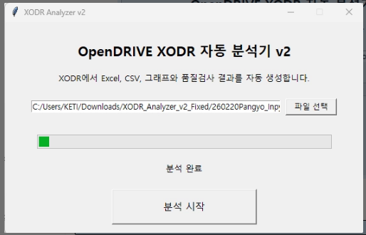
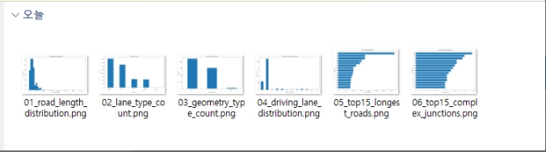
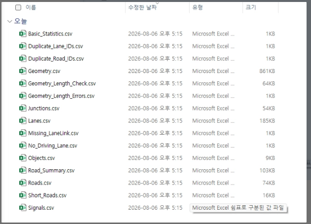
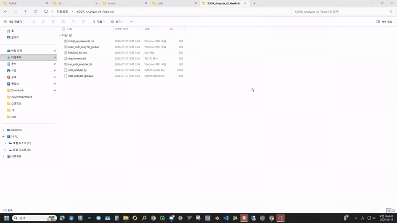

# XODR Analysis Guide & CSV Automation

<table>
  <tr>
    <th width="33%">Analyzer GUI</th>
    <th width="33%">Generated charts</th>
    <th width="33%">CSV analysis results</th>
  </tr>
  <tr>
    <td></td>
    <td></td>
    <td></td>
  </tr>
</table>

[English](#english) · [한국어](#한국어)

## English

This Windows tool automatically analyzes an OpenDRIVE (`.xodr`) road network with Python and Pandas, then generates an Excel workbook, individual CSV tables, charts, quality-check results, and execution logs. Select a file in the GUI or drag an XODR file onto the batch launcher to create a complete analysis folder.



> [Watch the full MP4 recording](docs/xodr-analyzer-demo.mp4)

### Download and report

- [Download XODR Analyzer v2](./XODR_Analyzer_v2_Fixed.zip)
- [Open the Pandas XODR analysis and automation report](./Pandas_XODR_Analysis_Report.html)

### Features

- Parses the XODR XML structure automatically
- Extracts Road, Lane, Geometry, Junction, Signal, and Object data
- Builds a per-road summary table
- Creates a consolidated Excel workbook
- Saves every analysis table as a CSV backup
- Generates charts for road length, lane types, geometry types, longest roads, and complex junctions
- Checks short roads, duplicate IDs, geometry-length mismatches, and missing lane links
- Writes execution and error logs
- Validates the generated XLSX before replacing the final workbook

### Installation

1. Download [XODR_Analyzer_v2_Fixed.zip](./XODR_Analyzer_v2_Fixed.zip).
2. Fully extract the ZIP file.
3. Run `install_requirements.bat` once.

Required Python packages:

```text
pandas
matplotlib
openpyxl
```

Python must be installed and available through the Windows `py` or `python` command.

### Running the analyzer

#### GUI

Run `open_xodr_analyzer_gui.bat`:

1. Select an `.xodr` file.
2. Click the analysis button.
3. The result folder opens automatically when processing finishes.

#### Drag and drop

Drag an `.xodr` file onto `run_xodr_analyzer.bat`.

#### Python command line

```powershell
python xodr_analyzer.py "C:\Maps\Pangyo.xodr"
```

An output directory may also be specified explicitly:

```powershell
python xodr_analyzer.py "C:\Maps\Pangyo.xodr" --output "C:\Maps\Pangyo_Report"
```

### Extracted tables

| Table | Contents |
|---|---|
| Roads | Road ID, name, length, and junction association |
| Lanes | Lane section, lane ID, type, width, and direction-related data |
| Geometry | Line, arc, spiral, poly3, paramPoly3, coordinates, and length |
| Junctions | Connections and lane-link relationships |
| Signals | Signal ID, position, orientation, country, type, and value |
| Objects | Road-object ID, type, position, and dimensions |
| Road Summary | Per-road lane, geometry, signal, and object counts |
| Basic Statistics | Overall counts, lengths, averages, and quality-check totals |

### Automated quality checks

- Unusually short roads
- Normal roads versus junction-internal roads
- Differences between road length and the sum of geometry lengths
- Missing lane links in junction connections
- Duplicate road IDs
- Duplicate lane IDs within the same lane section

The check tables are included in both Excel and CSV outputs so potential problems in large XODR networks can be filtered quickly.

### Output folder

Analyzing `Pangyo.xodr` creates the following folder beside the source file:

```text
Pangyo_analysis_result/
├─ Pangyo_XODR_Analysis.xlsx
├─ csv/
│  ├─ Basic_Statistics.csv
│  ├─ Roads.csv
│  ├─ Lanes.csv
│  ├─ Geometry.csv
│  ├─ Junctions.csv
│  ├─ Signals.csv
│  ├─ Objects.csv
│  └─ summary and quality-check CSV files
├─ charts/
│  ├─ 01_road_length_distribution.png
│  ├─ 02_lane_type_count.png
│  ├─ 03_geometry_type_count.png
│  ├─ 04_driving_lane_distribution.png
│  ├─ 05_top15_longest_roads.png
│  └─ 06_top15_complex_junctions.png
├─ analysis.log
└─ error.log (only when an error occurs)
```

CSV backups and available results are preserved even when the XODR does not contain every optional element.

### Excel integrity protection

XODR Analyzer v2 writes the workbook to a temporary file before publishing the final XLSX:

1. Write a temporary XLSX.
2. Validate the internal ZIP structure.
3. Reopen and validate it with `openpyxl`.
4. Replace the final workbook only after all checks pass.

Close an existing analysis workbook before running the tool again. If Excel has locked the output file, the analyzer reports a clear error while retaining CSV backups and logs.

### Use cases

- Inspect XODR files used by CARLA, SUMO, or RoadRunner
- Produce statistics and quality reports for large road networks
- Find potential road, lane, geometry, and junction errors
- Deliver review results as Excel and CSV
- Build automated comparisons across multiple regional XODR files

### Repository files

```text
xodr_analyzer.py                  analysis engine
xodr_analyzer_gui.pyw             desktop GUI
open_xodr_analyzer_gui.bat        GUI launcher
run_xodr_analyzer.bat             drag-and-drop/CLI launcher
install_requirements.bat          dependency installer
requirements.txt                  Python dependencies
XODR_Analyzer_v2_Fixed.zip        distributable package
Pandas_XODR_Analysis_Report.html  detailed analysis report
docs/xodr-analyzer-demo.gif       README demo
docs/xodr-analyzer-demo.mp4       original recording
```

### Planned extensions

- Batch analysis and comparison of multiple XODR files
- Automatic visualization of coordinate bounds and suspicious geometry
- Integration with RoadRunner, SUMO, and CARLA workflows
- Custom report templates and validation rules

---

## 한국어


OpenDRIVE(`.xodr`) 도로망을 Python·Pandas로 자동 분석하고 Excel, CSV, 그래프와 품질검사 결과를 생성하는 Windows 도구입니다. GUI에서 파일을 선택하거나 XODR을 BAT 파일에 드래그앤드롭하면 분석 결과 폴더가 자동 생성됩니다.

> 전체 원본 영상: [MP4 보기](docs/xodr-analyzer-demo.mp4)

## 다운로드 및 참고 자료

- [XODR Analyzer v2 다운로드](./XODR_Analyzer_v2_Fixed.zip)
- [Pandas 기반 XODR 분석 및 자동화 보고서](./Pandas_XODR_Analysis_Report.html)

## 주요 기능

- XODR XML 구조 자동 파싱
- Road, Lane, Geometry, Junction, Signal, Object 데이터 추출
- 도로별 종합 Summary 생성
- Excel 통합 보고서 저장
- 모든 분석표의 CSV 백업 저장
- 도로 길이, Lane 종류, Geometry 종류, 긴 도로, 복잡한 Junction 그래프 생성
- 짧은 Road, 중복 ID, Geometry 길이 불일치, Lane Link 누락 등 품질검사
- 실행 과정과 오류 로그 저장
- 손상된 Excel 파일이 최종 결과로 남지 않도록 무결성 검사 후 교체

## 설치

1. [XODR_Analyzer_v2_Fixed.zip](./XODR_Analyzer_v2_Fixed.zip)을 다운로드합니다.
2. ZIP을 완전히 압축 해제합니다.
3. 최초 한 번 `install_requirements.bat`을 실행합니다.

필요한 Python 패키지는 다음과 같습니다.

```text
pandas
matplotlib
openpyxl
```

Python이 설치되어 있어야 하며 Windows PATH에서 `py` 또는 `python` 명령을 사용할 수 있어야 합니다.

## 실행 방법

### GUI

`open_xodr_analyzer_gui.bat`을 실행합니다.

1. 분석할 `.xodr` 파일을 선택합니다.
2. 분석 시작 버튼을 누릅니다.
3. 완료되면 결과 폴더가 자동으로 열립니다.

### 드래그앤드롭

분석할 `.xodr` 파일을 `run_xodr_analyzer.bat` 위에 끌어다 놓습니다.

### Python 명령행

```powershell
python xodr_analyzer.py "C:\Maps\Pangyo.xodr"
```

출력 폴더를 직접 지정할 수도 있습니다.

```powershell
python xodr_analyzer.py "C:\Maps\Pangyo.xodr" --output "C:\Maps\Pangyo_Report"
```

## 분석 데이터

| 분석표 | 내용 |
|---|---|
| Roads | Road ID, 이름, 길이, Junction 연결 등 |
| Lanes | Lane Section, Lane ID, 종류, 폭, 주행 방향 등 |
| Geometry | Line, Arc, Spiral, Poly3, ParamPoly3와 좌표·길이 |
| Junctions | Connection과 Lane Link 연결 관계 |
| Signals | 신호 ID, 위치, 방향, 국가, 종류와 값 |
| Objects | 도로 객체의 ID, 종류, 위치와 크기 |
| Summary | Road별 Lane·Geometry·Signal·Object 집계 |
| Statistics | 전체 개수, 길이, 평균값과 품질검사 요약 |

## 자동 품질검사

프로그램은 분석과 함께 다음 항목을 검사합니다.

- 길이가 지나치게 짧은 Road
- 일반 Road와 Junction 내부 Road 구분
- Road 길이와 Geometry 길이 합계의 불일치
- Junction Connection의 Lane Link 누락
- 중복 Road ID
- 같은 Lane Section 내부의 중복 Lane ID

검사 결과는 Excel 시트와 CSV로 함께 저장되어 대규모 XODR의 오류 후보를 빠르게 필터링할 수 있습니다.

## 결과 폴더

입력 파일이 `Pangyo.xodr`이면 같은 위치에 다음 폴더가 생성됩니다.

```text
Pangyo_analysis_result/
├─ Pangyo_XODR_Analysis.xlsx
├─ csv/
│  ├─ Roads.csv
│  ├─ Lanes.csv
│  ├─ Geometry.csv
│  ├─ Junctions.csv
│  ├─ Signals.csv
│  ├─ Objects.csv
│  └─ 기타 요약·품질검사 CSV
├─ charts/
│  ├─ 01_road_length_distribution.png
│  ├─ 02_lane_type_count.png
│  ├─ 03_geometry_type_count.png
│  └─ 기타 분석 그래프
├─ analysis.log
└─ error.log (오류 발생 시)
```

XODR에 특정 항목이 없더라도 가능한 분석 결과와 CSV를 먼저 보존하도록 구성했습니다.

## Excel 저장 안정성

XODR Analyzer v2는 Excel 파일을 임시 위치에 먼저 저장한 뒤 다음 검사를 통과한 경우에만 최종 파일로 교체합니다.

1. XLSX ZIP 내부 구조 검사
2. `openpyxl` 재열기 검사
3. 검사 통과 후 최종 XLSX 교체

Excel 보고서를 열어 둔 채 같은 XODR을 다시 분석하면 저장할 수 없습니다. 기존 Excel 파일을 닫고 다시 실행하세요. Excel 저장이 실패하더라도 CSV 백업과 오류 로그는 유지됩니다.

## 활용 목적

- CARLA·SUMO·RoadRunner용 XODR 구조 검토
- 대규모 도로망 통계 및 품질관리
- Road/Lane/Junction 연결 오류 후보 탐색
- 개발·검수 결과의 Excel 보고
- 여러 지역 XODR을 비교하는 자동화 기반 마련

## 저장소 파일

```text
xodr_analyzer.py               분석 엔진
xodr_analyzer_gui.pyw          GUI
open_xodr_analyzer_gui.bat     GUI 실행기
run_xodr_analyzer.bat          드래그앤드롭/명령행 실행기
install_requirements.bat       Python 패키지 설치기
requirements.txt               의존성 목록
XODR_Analyzer_v2_Fixed.zip     배포용 ZIP
Pandas_XODR_Analysis_Report.html  상세 학습·분석 보고서
docs/xodr-analyzer-demo.gif    README 데모
docs/xodr-analyzer-demo.mp4    원본 영상
```

## 향후 확장

- 여러 XODR 폴더 일괄 분석 및 지역별 비교
- 좌표 범위와 비정상 Geometry 자동 시각화
- RoadRunner·SUMO·CARLA 파이프라인 연계
- 보고서 템플릿과 검수 기준 사용자 설정
